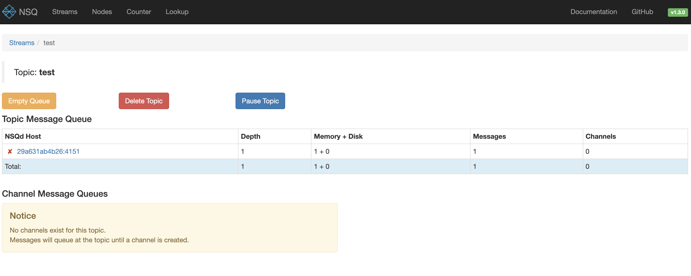
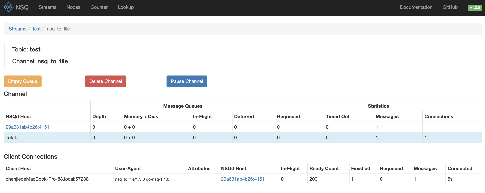

# nsq-study
## 安装
以 docker-compose 方式为例
文件见 docker-compose.yml
这里为了方便后续本地测试使用把端口都映射到宿主机对应端口，
```yaml
services:
  nsqlookupd:
    image: nsqio/nsq
    command: /nsqlookupd
    ports:
      - "4160:4160"
      - "4161:4161"
  nsqd:
    image: nsqio/nsq
    command: /nsqd --lookupd-tcp-address=nsqlookupd:4160
    depends_on:
      - nsqlookupd
    ports:
      - "4150:4150"
      - "4151:4151"
  nsqadmin:
    image: nsqio/nsq
    command: /nsqadmin --lookupd-http-address=nsqlookupd:4161
    depends_on:
      - nsqlookupd
    ports:
      - "4171:4171"
```
在 docker-compose.yml 文件所在目录下执行 docker-compose up -d 启动,启动后 docker 容器会自动创建好 nsqlookupd、nsqd、nsqadmin 三个容器,

nsqd 是核心服务, nsqlookupd 是 nsqd 的发现服务, nsqadmin 是 nsqd 的监控服务，

nsqd用于客户端消费和生产消息，它可以通过注册到 nsqlookupd 暴露给客户端来消费消息。

然后可以用 docker-compose ps  查看容器状态和端口映射情况
```
CONTAINER ID   IMAGE       COMMAND                   CREATED         STATUS         PORTS                                                            NAMES
2d7d7d85ba0c   nsqio/nsq   "/nsqadmin --lookupd…"   7 seconds ago   Up 7 seconds   4150-4151/tcp, 4160-4161/tcp, 4170/tcp, 0.0.0.0:4171->4171/tcp   nsq-study-nsqadmin-1
29a631ab4b26   nsqio/nsq   "/nsqd --lookupd-tcp…"   7 seconds ago   Up 7 seconds   4160-4161/tcp, 0.0.0.0:4150-4151->4150-4151/tcp, 4170-4171/tcp   nsq-study-nsqd-1
5e13afe9448b   nsqio/nsq   "/nsqlookupd"             8 seconds ago   Up 7 seconds   4150-4151/tcp, 4170-4171/tcp, 0.0.0.0:4160-4161->4160-4161/tcp   nsq-study-nsqlookupd-1
```

## 命令行处理消息

### 生产消息
```
curl -d 'hello world 1' 'http://127.0.0.1:4151/pub?topic=test'
```
可以在http://0.0.0.0:4171/topics/test 下查看topic详情,可以看到

这里的 nsqd host就是 nsqd的容器 id,目前没有 channel 消费者,所以消息会一直存在,此时消息的积压是 1（depth),
而且都是积压在内存的，内存 1 磁盘 0 条。这时如果突然断电，内存消息就丢了，他的内部结构起是就是一个buffer chan，只有消息积压超过 chan size 才会落盘，
这是 nsq的设计特点，如果确认业务可以接受这个特性。

### 消费消息
```
nsq_to_file --topic=test --output-dir=/tmp --lookupd-http-address=127.0.0.1:4161
```
这里直接这么操作会报错 " error connecting to nsqd - dial tcp: lookup 29a631ab4b26: no such host"，
因为消费者在宿主机网络中，不在 docker网络中，无法识别这个容器 id, 如果把消费者也用 docker  容器运行就不会出现这个问题，
这里因为上面在 docker-compose.yml中已经做了端口映射，这里直接在宿主机/etc/hosts 添加 
```
127.0.0.1 29a631ab4b26
```
相当于消费者直接连接的宿主机的 4151 端口来进行消费，
重新执行消费命令
```
2025/01/15 16:41:25 INF    1 [test/nsq_to_file] querying nsqlookupd http://127.0.0.1:4161/lookup?topic=test
2025/01/15 16:41:25 INF    1 [test/nsq_to_file] (29a631ab4b26:4150) connecting to nsqd
[nsq_to_file] 2025/01/15 16:41:55.201218 INFO: [test/nsq_to_file] opening /tmp/test.chenjiedeMacBook-Pro-88.2025-01-15_16.log
2025/01/15 16:42:36 INF    1 [test/nsq_to_file] querying nsqlookupd http://127.0.0.1:4161/lookup?topic=test
2025/01/15 16:43:36 INF    1 [test/nsq_to_file] querying nsqlookupd http://127.0.0.1:4161/lookup?topic=test
2025/01/15 16:44:36 INF    1 [test/nsq_to_file] querying nsqlookupd http://127.0.0.1:4161/lookup?topic=test
2025/01/15 16:45:36 INF    1 [test/nsq_to_file] querying nsqlookupd http://127.0.0.1:4161/lookup?topic=test
2025/01/15 16:46:36 INF    1 [test/nsq_to_file] querying nsqlookupd http://127.0.0.1:4161/lookup?topic=test
2025/01/15 16:47:36 INF    1 [test/nsq_to_file] querying nsqlookupd http://127.0.0.1:4161/lookup?topic=test
2025/01/15 16:48:36 INF    1 [test/nsq_to_file] querying nsqlookupd http://127.0.0.1:4161/lookup?topic=test
```
连接nsqd 成功，然后就可以看到消息被消费了，这里可以看到消费者会周期性查询 nsqlookupd 以便在 nsqd有更新时及时感知，
所以消费者一般建议使用 nsqlookupd的方式消费而不是直连nsqd
``` 
cat  /tmp/test.chenjiedeMacBook-Pro-88.2025-01-15_16.log      

hello world 1
```
我们再看下 nsqadmin 下channel 消费情况http://0.0.0.0:4171/topics/test/nsq_to_file

当前 channel 有一个消费连接，已经消费完成一条。

## 程序处理消息
除了 curl 和 nsq自带的nsq_to_file等来进行消息处理，nsq还支持丰富的语言库
这里用 go 的库为例 https://github.com/nsqio/go-nsq

### 生产消息
生产者和 nsqd直连，1 对 1的关系，使用 tcp 连接 
```go
package main

import (
	"fmt"
	"log"
	"time"

	nsq "github.com/nsqio/go-nsq"
)

func main() {
	cfg := nsq.NewConfig()
	// 连接 nsqd 的 tcp 连接
	producer, err := nsq.NewProducer("127.0.0.1:4150", cfg)
	if err != nil {
		log.Fatal(err)
	}

	// 发布消息
	var count int
	for {
		count++
		body := fmt.Sprintf("chenjie.info %d", count)
		if err := producer.Publish("chenjie.info", []byte(body)); err != nil {
			log.Fatal("publish error: " + err.Error())
		}
		time.Sleep(1 * time.Second)
	}
}

```
### 消费消息
消费者有 4 种连接方式，分别是 nsqd 直连，多个nsqd直连，nsqlookupd 连接，多个 nsqlookupd 连接，
这里推荐用第四种方式，也就是多个 nsqlookupd 连接的方式，因为多个 nsqlookupd 是独立存在的，
如果其中一个挂了，那么消费者会继续使用其他 nsqlookupd 进行 nsqd服务发现，解决了消费者服务发现高可用的问题。
```go
package main

import (
	"log"

	nsq "github.com/nsqio/go-nsq"
)

func main() {
	cfg := nsq.NewConfig()
	consumer, err := nsq.NewConsumer("chenjie.info", "chenjie.info", cfg)
	if err != nil {
		log.Fatal(err)
	}

	// 处理信息
	consumer.AddHandler(nsq.HandlerFunc(func(message *nsq.Message) error {
		log.Println(string(message.Body))
		return nil
	}))

	// 1 连接 nsqd 的 tcp 连接
	//if err := consumer.ConnectToNSQD("127.0.0.1:4150"); err != nil {
	//	log.Fatal(err)
	//}

	// 2 连接 nsqd 的 tcp 连接【多个】,在多个 nsqd上消费
	//if err := consumer.ConnectToNSQDs([]string{"127.0.0.1:4150"}); err != nil {
	//	log.Fatal(err)
	//}

	// 3 连接nsqlookupd 的 http连接
	//if err := consumer.ConnectToNSQLookupd("127.0.0.1:4161"); err != nil {
	//	log.Fatal(err)
	//}

	// 4 连接nsqlookupd 的 http连接【多个】，多个 nsqlookupd上检索 nsqd信息，各个 nsqlookupd互相独立，对于消费者而言是备用关系
	if err := consumer.ConnectToNSQLookupds([]string{"127.0.0.1:41610", "127.0.0.1:4161", "127.0.0.1:41611"}); err != nil {
		log.Fatal(err)
	}
	<-consumer.StopChan
}

```
